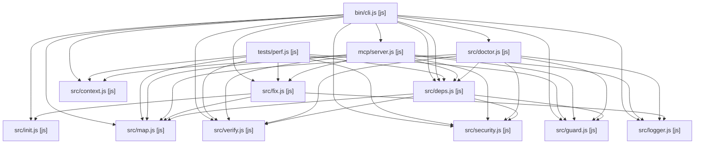

# Architecture (generated by deep-era from real imports)

Generated: 2026-09-07T13:46:06.142Z | Files: 38 | Showing top 15 connected modules

Most-imported (change carefully):
- src/map.js (used by 9)
- src/guard.js (used by 6)
- src/security.js (used by 6)
- src/verify.js (used by 6)
- src/deps.js (used by 5)
