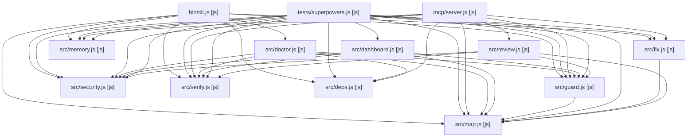

# Architecture (generated by deep-era from real imports)

Generated: 2026-10-06T12:56:55.248Z | Files: 108 | Showing top 15 connected modules

```mermaid
flowchart TD
  n62696e2f636c["bin/cli.js [js]"]
  n74657374732f["tests/run.js [js]"]
  n6d63702f7365["mcp/server.js [js]"]
  n7372632f6d61["src/map.js [js]"]
  n7372632f646f["src/doctor.js [js]"]
  n7372632f6461["src/dashboard.js [js]"]
  n7372632f6775["src/guard.js [js]"]
  n7372632f7365["src/security.js [js]"]
  n7372632f7665["src/verify.js [js]"]
  n74657374732f["tests/perf.js [js]"]
  n7372632f6669["src/fix.js [js]"]
  n7372632f6d65["src/memory.js [js]"]
  n7372632f7265["src/review.js [js]"]
  n74657374732f["tests/superpowers.js [js]"]
  n7372632f6465["src/deps.js [js]"]
  n62696e2f636c-->n7372632f646f
  n62696e2f636c-->n7372632f6d61
  n62696e2f636c-->n7372632f7665
  n62696e2f636c-->n7372632f7365
  n62696e2f636c-->n7372632f6775
  n62696e2f636c-->n7372632f6465
  n62696e2f636c-->n7372632f6669
  n62696e2f636c-->n7372632f6d65
  n74657374732f-->n7372632f6d61
  n74657374732f-->n7372632f7365
  n74657374732f-->n7372632f7665
  n74657374732f-->n7372632f6669
  n74657374732f-->n7372632f6775
  n74657374732f-->n7372632f6d65
  n74657374732f-->n7372632f6465
  n6d63702f7365-->n7372632f6d61
  n6d63702f7365-->n7372632f7665
  n6d63702f7365-->n7372632f7365
  n6d63702f7365-->n7372632f6775
  n6d63702f7365-->n7372632f6d65
  n6d63702f7365-->n7372632f6669
  n6d63702f7365-->n7372632f7265
  n6d63702f7365-->n7372632f6465
  n7372632f646f-->n7372632f6d61
  n7372632f646f-->n7372632f7665
  n7372632f646f-->n7372632f7365
  n7372632f646f-->n7372632f6775
  n7372632f646f-->n7372632f6465
  n7372632f6461-->n7372632f6d61
  n7372632f6461-->n7372632f7665
  n7372632f6461-->n7372632f7365
  n7372632f6461-->n7372632f6775
  n7372632f6775-->n7372632f6d61
  n74657374732f-->n7372632f6d61
  n74657374732f-->n7372632f6775
  n74657374732f-->n7372632f7365
  n74657374732f-->n7372632f7665
  n74657374732f-->n7372632f6d65
  n7372632f6669-->n7372632f6d61
  n7372632f7265-->n7372632f6d61
  n7372632f7265-->n7372632f7665
  n7372632f7265-->n7372632f7365
  n7372632f7265-->n7372632f6775
  n74657374732f-->n7372632f6461
```

Most-imported (change carefully):
- src/map.js (used by 14)
- src/guard.js (used by 8)
- src/security.js (used by 8)
- src/verify.js (used by 8)
- package.json (used by 6)
